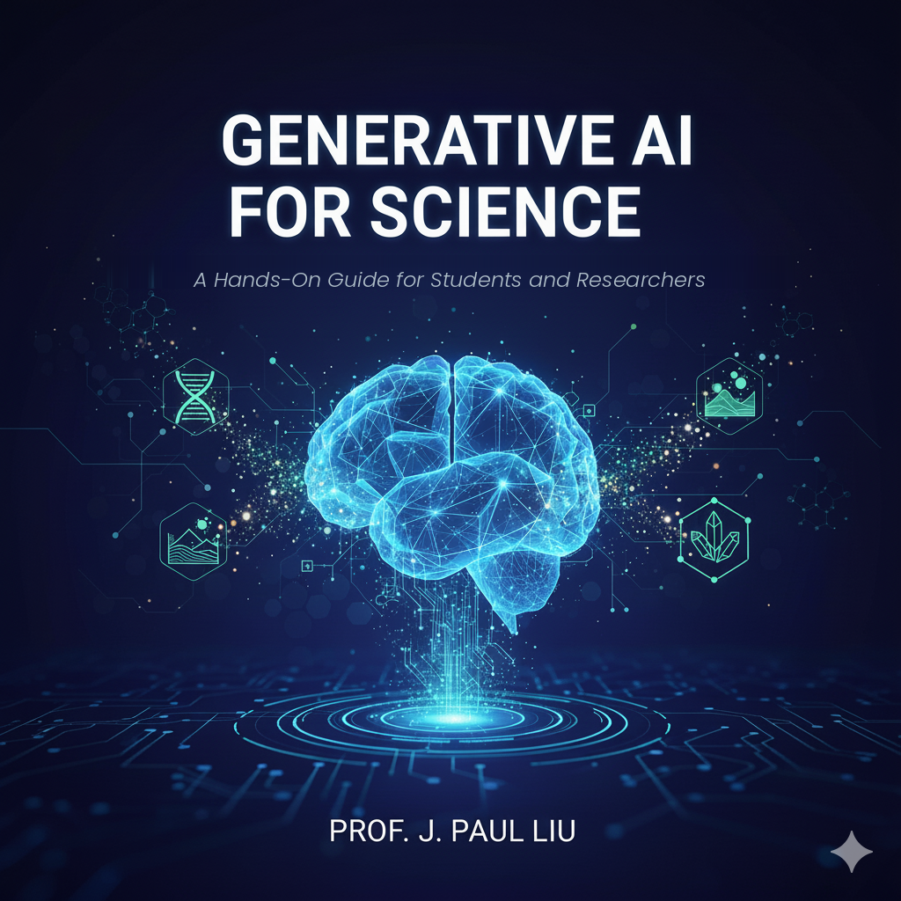

# 🧬 Generative AI for Science
## - A Hands-On Guide for Students and Researchers
### Design molecules. Predict protein structures. Accelerate climate models. All with AI.

<p align="center">
  
</p>

<p align="center">
  <strong>500+ pages • 13 chapters • 50+ runnable notebooks • Zero setup required</strong>
</p>

<p align="center">
  <a href="https://leanpub.com/generativeaiforscience"></a>
  <a href="#-quick-start"></a>
  <a href="https://www.amazon.com/dp/B0GGHD79VR" target="_blank" rel="noopener">
  
</a>
  <a href="#"></a>
</p>

<p align="center">
  <em>By Dr. J. Paul Liu</em><br>
  📢 <strong>Updated regularly based on student & reader feedback</strong>
</p>

---

## 🔥 Why This Book?

| The Revolution | The Impact |
|----------------|------------|
| 🧪 AI-designed drugs | **80-90% Phase I success** vs traditional 40-65% |
| 🧬 AlphaFold protein prediction | **2024 Nobel Prize in Chemistry** |
| 🌍 GenCast weather AI | Outperforms best models in **97% of scenarios** |
| ⚡ Neural surrogates | Simulations **1000x faster** than traditional methods |

**This book teaches you HOW to start and build educational-similar systems yourself.**

---

## 🎯 What Can You Build?

| In 30 Minutes | You'll Create | Using |
|---------------|---------------|-------|
| 🧪 Drug Discovery | Design molecules with target properties | GNNs + Diffusion |
| 🧬 Protein Engineering | Predict 3D structure from sequence | ESMFold |
| 🌍 Climate Science | Fast weather/climate emulators | Neural Surrogates |
| ⚛️ Physics Simulation | Solve PDEs with neural networks | PINNs |
| 📚 Literature Mining | Extract insights from papers | RAG + LLMs |

---

## 📖 About This Book

**Generative AI for Science** is a comprehensive, hands-on guide for researchers, students, and practitioners who want to apply cutting-edge AI techniques to scientific discovery. This book bridges the gap between AI/ML expertise and domain science, providing practical implementations across chemistry, biology, physics, geoscience, and beyond.

> *"Generative AI does not replace the scientific method—it enhances it. It expands the space of hypotheses we can explore, sharpens experimental design, and reveals patterns hidden in complexity."*

### ✨ What Makes This Book Different

| Feature | Description |
|---------|-------------|
| 🔬 **Theory Meets Practice** | Every concept is paired with ready-to-run code |
| 💻 **Interactive Learning** | All examples provided as Google Colab notebooks—no installation required |
| 🧪 **Real Scientific Problems** | Examples from authentic research across multiple domains |
| 📊 **Accessible Yet Rigorous** | Suitable for domain scientists exploring AI and ML experts entering scientific applications |

---

## 🎓 Who Is This For?

| You Are... | You'll Get... |
|------------|---------------|
| 🔬 **Domain Scientist** | AI skills to accelerate your research |
| 💻 **ML Engineer** | Scientific applications for your expertise |
| 🎓 **Graduate Student** | Complete curriculum with hands-on projects |
| 👔 **Industry Practitioner** | Production-ready code and best practices |

---

## ✅ What You Will Learn

By the end of this book, you will:

- ✅ Understand key AI architectures: **Transformers**, **Diffusion Models**, **VAEs**, and **GNNs**
- ✅ Represent scientific data types effectively for AI models
- ✅ Apply generative models to problems in **climate science**, **drug discovery**, **genomics**, **materials science**, and more
- ✅ Follow best practices around **ethics**, **reproducibility**, and **deployment**
- ✅ Stay current with emerging methods and future directions
- ✅ Develop the intuition to know *when* and *how* to apply AI to scientific research

---

## 📚 Table of Contents

### Part I: Foundations

| Chapter | Title | Topics |
|---------|-------|--------|
| 1 | **Generative AI: A New Frontier for Scientific Discovery** | AI revolution in science, core technologies, cross-cutting capabilities |
| 2 | **Generative AI Fundamentals** | Transformers, LLMs, Diffusion Models, VAEs, GANs, attention mechanisms |
| 3 | **Scientific Data & Workflows** | Data challenges, FAIR principles, data preparation, workflow automation |
| 4 | **Text, Code & Knowledge Generation** | Literature synthesis, RAG, hypothesis generation, code generation, scientific writing |

### Part II: Core Techniques

| Chapter | Title | Topics |
|---------|-------|--------|
| 5 | **Data-to-Data Models** | Missing data imputation, synthetic data with GANs, VAEs, Gaussian processes, time series |
| 6 | **Physics-Informed AI and Simulation** | PINNs, neural surrogates, code optimization, automated testing |

### Part III: Domain Applications

| Chapter | Title | Topics |
|---------|-------|--------|
| 7 | **Domain Applications** | Chemistry & Materials, Biology & Biomedicine, Physics & Engineering, Geoscience & Climate |

<details>
<summary><b>📂 Chapter 7 Detailed Breakdown (click to expand)</b></summary>

**Part I: Chemistry & Materials Science**
- Molecular Graph Learning (GNNs)
- Molecular Generation with Diffusion Models
- Crystal Structure Prediction
- Reaction Outcome Prediction with Transformers

**Part II: Biology & Biomedicine**
- Protein Structure Prediction (ESMFold, AlphaFold2)
- Protein Sequence Generation (ProteinMPNN, RFDiffusion)
- Genomic Variant Analysis
- Clinical Trial Optimization

**Part III: Physics & Engineering**
- Particle Physics Applications
- Quantum Systems
- Materials Characterization

**Part IV: Geoscience & Climate**
- Ocean Forecasting
- Hurricane Prediction
- Climate Modeling
- Weather AI (GenCast, Aurora)

**Part V: Cross-Cutting Applications**
- Transfer Learning
- Multi-task Learning
- Foundation Models

</details>

### Part IV: Production & Best Practices

| Chapter | Title | Topics |
|---------|-------|--------|
| 8 | **Fine-Tuning & Domain Adaptation** | LoRA, PEFT, domain-specific training, evaluation strategies |
| 9 | **Multimodal Generative AI** | Vision-language models, graph-text models, multimodal fusion |
| 10 | **Evaluation, Validation & Benchmarking** | Metrics, validation strategies, uncertainty quantification, robustness testing |
| 11 | **Ethics & Responsible AI** | Reproducibility, bias & fairness, environmental impact, dual-use, data privacy |
| 12 | **Deployment & MLOps** | Experiment tracking, data versioning, model lifecycle, continuous training |
| 13 | **Future Directions & Conclusion** | Emerging architectures, foundation models, AI reasoning, open challenges |

---

## 🚀 Quick Start

### Prerequisites

```
✅ Basic Python (functions, loops, data structures)
✅ Undergraduate statistics (helpful but not required)
✅ A web browser + curiosity
❌ No prior deep learning experience needed
```

### Get Started in 3 Steps

1. **📖 Get the 500-page book**
   
   👉 [https://leanpub.com/generativeaiforscience](https://leanpub.com/generativeaiforscience)

   👉 [https://www.amazon.com/dp/B0GGHD79VR](https://www.amazon.com/dp/B0GGHD79VR)
   
3. **📥 Pick up a chapter**

  - Read the chapter and open that chapter's Colab Notebook 

3. **▶️ Open any notebook in Google Colab**
   - Click the "Open in Colab" badge in each notebook
   - Or upload directly to [colab.research.google.com](https://colab.research.google.com)
   - GPU runtime recommended for deep learning examples

---

## 📂 Repository Structure

```
Generative_AI_For_Science/
├── 📁 Chapter01_Introduction/
│   └── 📓 Ch01_AI_Scientific_Discovery.ipynb
├── 📁 Chapter02_Fundamentals/
│   ├── 📓 Ch02_Transformers.ipynb
│   ├── 📓 Ch02_Diffusion_Models.ipynb
│   └── 📓 Ch02_VAEs_GANs.ipynb
├── 📁 Chapter03_Data_Workflows/
│   └── 📓 Ch03_Scientific_Data.ipynb
├── 📁 Chapter04_Text_Code_Knowledge/
│   ├── 📓 Ch04_RAG_Literature.ipynb
│   └── 📓 Ch04_Code_Generation.ipynb
├── 📁 Chapter05_Data_to_Data/
│   ├── 📓 Ch05_Autoencoders.ipynb
│   ├── 📓 Ch05_GANs.ipynb
│   ├── 📓 Ch05_VAEs.ipynb
│   └── 📓 Ch05_Time_Series.ipynb
├── 📁 Chapter06_Physics_Informed/
│   ├── 📓 Ch06_PINNs.ipynb
│   └── 📓 Ch06_Neural_Surrogates.ipynb
├── 📁 Chapter07_Domain_Applications/
│   ├── 📓 Ch07_Chemistry_GNNs.ipynb
│   ├── 📓 Ch07_Molecular_Diffusion.ipynb
│   ├── 📓 Ch07_Protein_Structure.ipynb
│   ├── 📓 Ch07_Genomics.ipynb
│   └── 📓 Ch07_Climate_AI.ipynb
├── 📁 Chapter08_FineTuning/
│   └── 📓 Ch08_LoRA_PEFT.ipynb
├── 📁 Chapter09_Multimodal/
│   └── 📓 Ch09_Vision_Language.ipynb
├── 📁 Chapter10_Evaluation/
│   └── 📓 Ch10_Metrics_Validation.ipynb
├── 📁 Chapter11_Ethics/
│   └── 📓 Ch11_Responsible_AI.ipynb
├── 📁 Chapter12_Deployment/
│   └── 📓 Ch12_MLOps.ipynb
├── 📁 slides/
│   └── 📊 PowerPoint slides for each chapter
├── 📁 assets/
│   └── 🖼️ Figures and images
└── 📄 README.md
```

---

## 💡 How to Use This Book

| Use Case | Recommendation |
|----------|----------------|
| 📖 **As a course text** | Follow chapters sequentially for structured introduction |
| 🔍 **As a reference** | Jump directly to sections relevant to your research domain |
| 💻 **As a hands-on guide** | Open Colab notebooks alongside each chapter, run and modify code |
| 🚀 **As a research launchpad** | Use provided implementations as starting points for your projects |

---

## 🔬 Featured Applications

### 🧪 Chemistry & Materials
- **Molecular Property Prediction** with Graph Neural Networks
- **Drug Design** with Diffusion Models
- **Crystal Structure Prediction** with AI
- **Reaction Prediction** with Transformers

### 🧬 Biology & Biomedicine
- **Protein Structure Prediction** (ESMFold, AlphaFold2)
- **Protein Design** (ProteinMPNN, RFDiffusion)
- **Variant Effect Prediction** for genomics
- **Clinical Trial Optimization**

### 🌍 Geoscience & Climate
- **Weather Forecasting** with GenCast
- **Ocean Dynamics** modeling
- **Climate Projection** with surrogates
- **Extreme Event Prediction**

### ⚛️ Physics & Engineering
- **Physics-Informed Neural Networks** (PINNs)
- **Neural Network Surrogates** for simulations
- **Uncertainty Quantification**

---

## 📊 Key Technologies Covered

| Architecture | Use Cases | Scientific Applications |
|--------------|-----------|------------------------|
| **Transformers & LLMs** | Text, code, sequences | Literature synthesis, protein sequences, code generation |
| **Diffusion Models** | Structured outputs, images | Molecular structures, protein folding, climate data |
| **VAEs & GANs** | Latent space learning | Synthetic data, anomaly detection, compression |
| **Graph Neural Networks** | Molecular graphs | Property prediction, reaction prediction |
| **Physics-Informed NNs** | PDEs, conservation laws | Fluid dynamics, heat transfer, wave propagation |

---

## 🛠️ Installation (Optional Local Setup)

While all notebooks run in Google Colab, you can also set up locally:

```bash
# Create virtual environment
python -m venv genai-science
source genai-science/bin/activate  # Linux/Mac
# or: genai-science\Scripts\activate  # Windows

# Install dependencies
pip install -r requirements.txt
```

### Core Dependencies

```
torch>=2.0
transformers>=4.30
rdkit
numpy
pandas
matplotlib
scikit-learn
```

---

## 📈 Computational Requirements

| Model Type | GPU Memory | Recommended Platform |
|------------|------------|---------------------|
| Small models (GNNs, VAEs) | < 4 GB | Colab Free Tier |
| Medium models (Diffusion) | 4-8 GB | Colab Pro |
| Large models (LLMs, ESMFold) | 16+ GB | Colab Pro+, A100 |

---

## 🤝 Contributing

We welcome contributions! Please see our [Contributing Guidelines](CONTRIBUTING.md) for details.

### Ways to Contribute
- 🐛 Report bugs or issues
- 💡 Suggest new examples or applications
- 📝 Improve documentation
- 🔧 Submit code improvements
- 🌍 Translate content

---

## 📜 Citation

If you use this book or code in your research, please cite:

```bibtex
@book{liu2026generativeai,
  title     = {Generative AI for Science},
  author    = {Liu, J. Paul},
  year      = {2026},
  publisher = {Leanpub},
  url       = {https://leanpub.com/generativeaiforscience}
}
```

Or simply:

> J. Paul Liu, 2026. *Generative AI for Science*. Leanpub, https://leanpub.com/generativeaiforscience

---

## 📬 Contact & Community

| Platform | Link |
|----------|------|
| 📧 **Email** | [Contact through Leanpub](https://leanpub.com/generativeaiforscience) |
| 🐦 **Twitter / X** | [@jpliu168](https://x.com/jpliu168) — follow for updates |
| 💼 **LinkedIn** | [Paul Liu](https://www.linkedin.com/in/paul-liu-ba408025/) — connect for professional updates |
| 💬 **Discussions** | Use GitHub Discussions for Q&A |
| 🐛 **Issues** | Report bugs via GitHub Issues |

---

## 🙏 Acknowledgements

This book was developed through:
- Graduate courses at the Data Science and AI Academy
- Bioinformatics Research Center workshops
- Cross-campus AI for Research training programs
- Research Triangle AI Society–LLM intensive bootcamps
- Collaborations in oceanography, materials science, protein engineering, and literature mining

Special thanks to all students and colleagues who provided feedback and helped refine the material.

---

## 📄 License

This project is licensed under the MIT License - see the [LICENSE](LICENSE) file for details.

The book content is © 2026 J. Paul Liu. Code examples are provided under MIT License for educational use.

---

## ⭐ Support This Project

If you find this resource helpful:
- ⭐ **Star this repository** to help others discover it
- 🐦 **Share on Twitter/LinkedIn** to spread the word
- 📖 **Get the book** to support continued development
- 💬 **Leave feedback** to help improve future editions

---

<p align="center">
  <strong>🚀 Ready to accelerate your scientific discovery with AI?</strong>
  <br><br>
  <a href="https://leanpub.com/generativeaiforscience">
    
  </a>
  <br><br>
<a href="https://www.amazon.com/dp/B0GGHD79VR" target="_blank" rel="noopener">
  
</a>
</p>

---

<p align="center">
  <em>"Combine human creativity with machine assistance, and new discoveries become possible."</em>
  <br>
  — Dr. J. Paul Liu
</p>

---
Other related book:<br>
<b>How to Build and Fine-Tune a Small Lanugage Model:</b><br>

<br>
<a href=https://leanpub.com/howtobuildandfine-tuneasmalllanguagemodel>https://leanpub.com/howtobuildandfine-tuneasmalllanguagemodel</a><br>
<a href=https://www.amazon.com/dp/B0G3MYWTJK>https://www.amazon.com/dp/B0G3MYWTJK</a>

<!--
SOCIAL MEDIA OPTIMIZATION NOTES:
================================
For best social sharing, add these files to your repository:

1. Create a `social_preview.png` (1280x640px) with:
   - Book title prominently displayed
   - Key stats: "500+ pages • 13 chapters • 50+ notebooks"
   - Tagline: "Design molecules. Predict proteins. Accelerate science."
   - Visual elements: molecules, proteins, climate visualizations

2. Add to repository settings → Social Preview → Upload image

3. Short description for GitHub: 
   "🧬 Hands-on guide to Transformers, Diffusion Models & AI for scientific discovery. 
   500+ pages, 50+ Colab notebooks. Design molecules, predict proteins, accelerate climate models."

4. Topics to add: 
   generative-ai, machine-learning, scientific-computing, drug-discovery, 
   protein-structure, climate-science, transformers, diffusion-models, 
   physics-informed-neural-networks, deep-learning
-->
